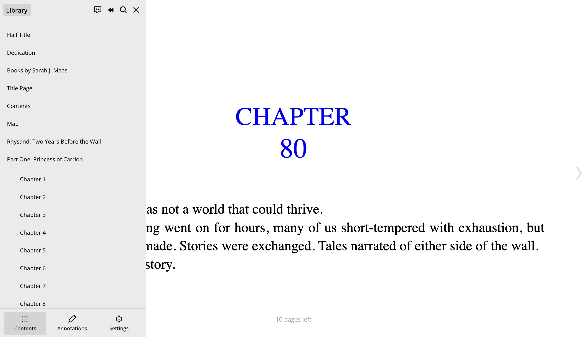
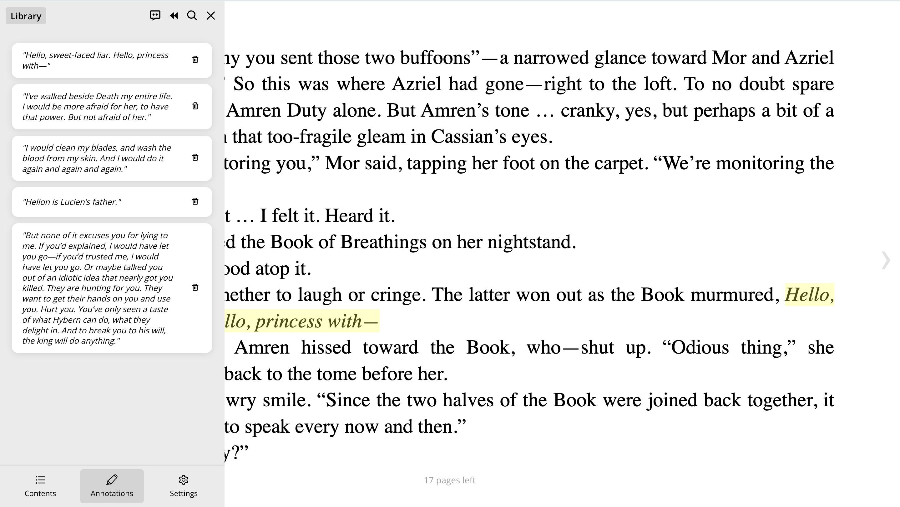
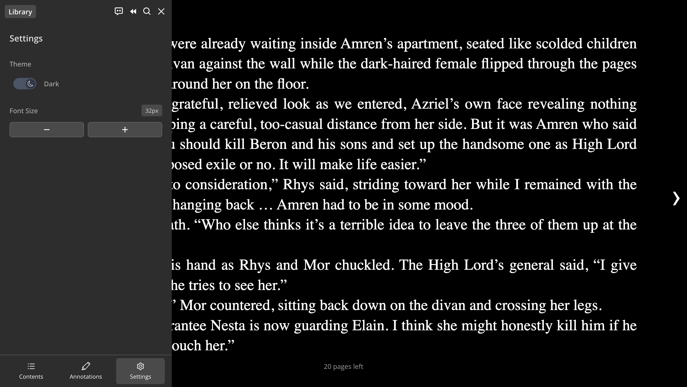
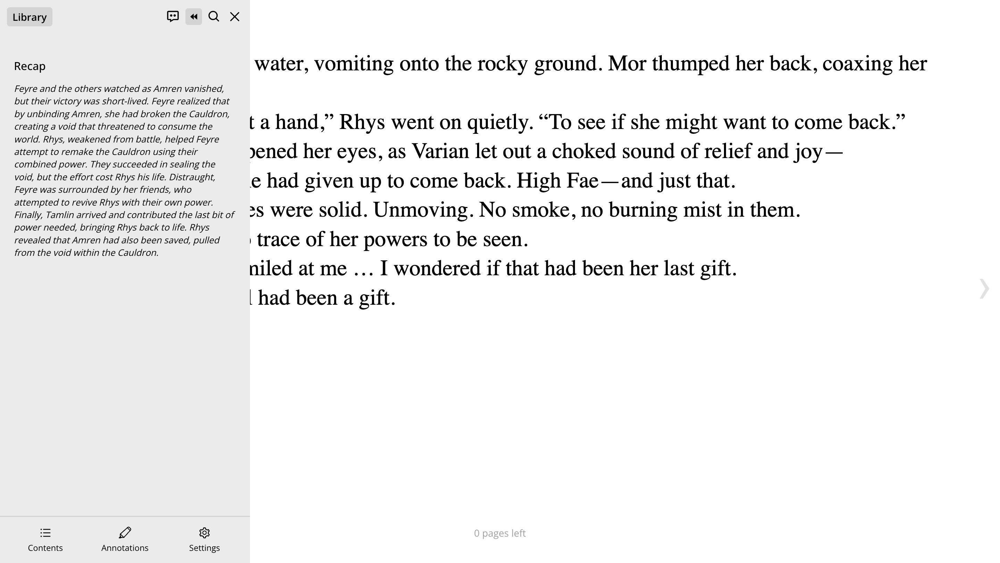
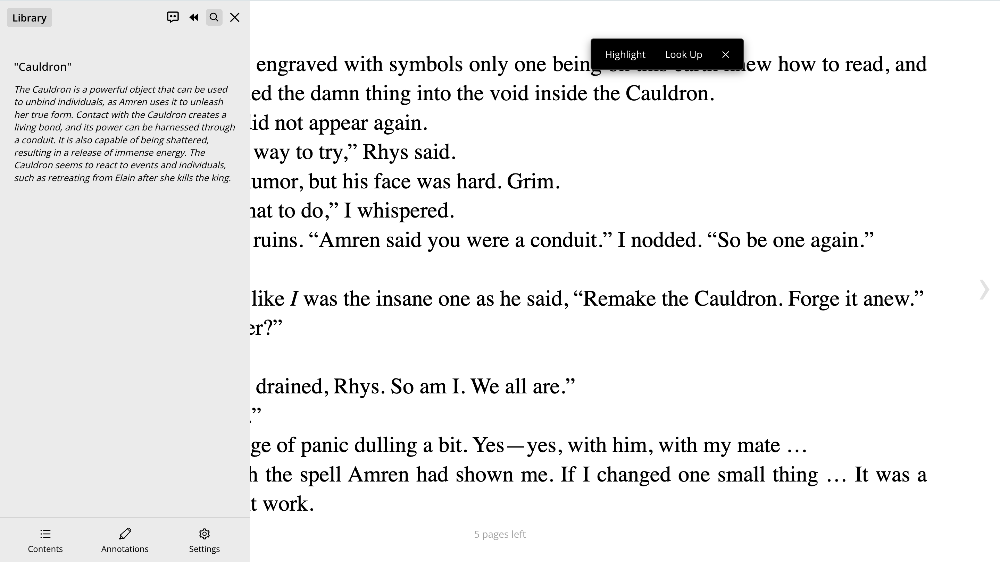
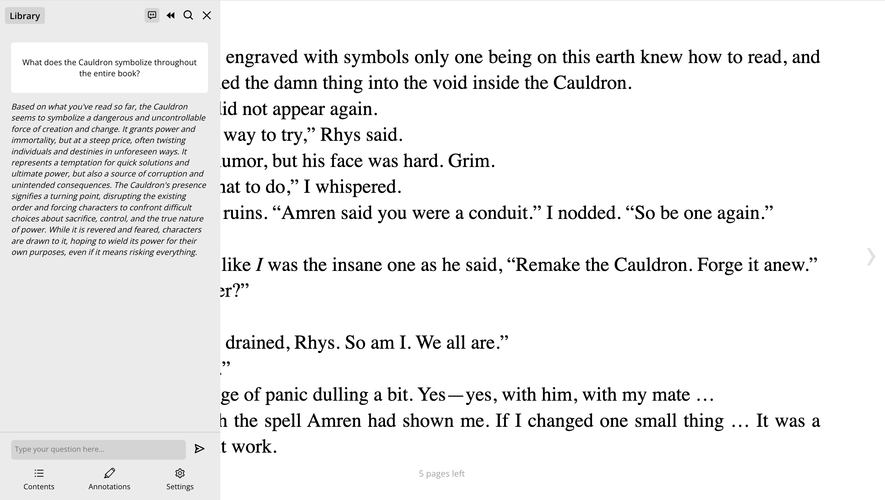

# 📖 Smart Ebook Reader

A smart EPUB reader that helps you read, understand, and engage with stories on a deeper level. Highlight text to get in-context explanations, ask questions about the plot or characters, and get quick recaps as you go.

---

## ✨ Features

- **EPUB Reading**  
  Import and read `.epub` files with a clean, responsive interface.

- **Recap**  
  Instantly get a summary of what’s happened so far based on your current place in the book.

- **Look Up**  
  Highlight any name, place, or event to see what it means in the context of the story.

- **Ask a Question**  
  Ask natural language questions about the book and get relevant answers from a Gemini-powered assistant.

- **Annotations and Highlights**  
  Highlight important passages and keep your notes while reading.

- **Settings**  
  Toggle between light and dark mode and adjust font size for a comfortable reading experience.

---

## 🛠️ Getting Started

### Prerequisites

- Node.js
- Python 3.x
- Gemini API Key (via Google AI Studio or Vertex AI)

### Setup

```bash
# Clone the repo
git clone https://github.com/Isha1218/Smart-Ebook-Reader.git
cd Smart-Ebook-Reader

# Frontend setup
cd client
npm install
npm run dev

# Backend setup
cd ../server
pip install -r requirements.txt
```

---

## 📸 Feature Previews

### 📑 Table of Contents

Navigate chapters easily with the built-in EPUB table of contents.  


---

### ✍️ Annotations

Highlight and annotate important passages as you read.  


---

### 🌙 Dark Mode

Switch between light and dark themes for a comfortable reading experience.  


---

### 🧠 Recap

Get a quick summary of what's happened so far in the story.  


---

### 🔍 Look Up

Highlight any character, place, or event to get an in-context explanation.  


---

### 💬 Ask a Question

Ask natural-language questions about the story and get AI-powered answers.  

